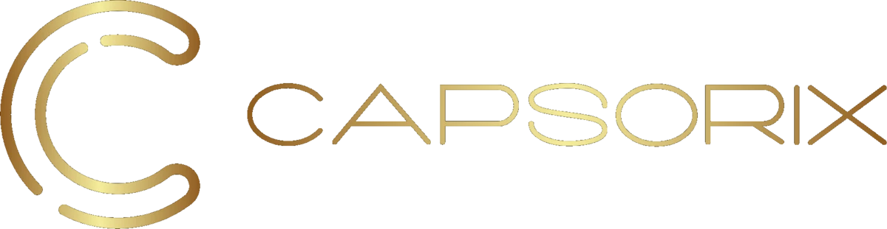
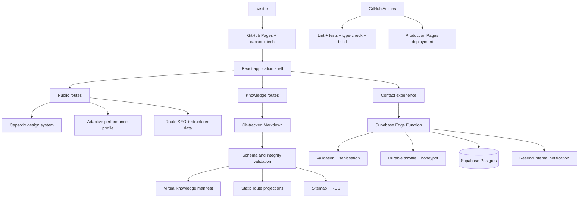

<div align="center">
  <a href="https://capsorix.tech" aria-label="Capsorix website">
    
  </a>

  <h1>Capsorix</h1>

  <p><strong>Strategy, design and engineering for ambitious digital products.</strong></p>
  <p>The official Capsorix website, institutional knowledge platform and production lead-intake system.</p>

  <p>
    <a href="https://capsorix.tech"><strong>Live website</strong></a>
    ·
    <a href="https://capsorix.tech/knowledge"><strong>Knowledge Platform</strong></a>
    ·
    <a href="https://capsorix.tech/knowledge/canon"><strong>Foundational Canon</strong></a>
  </p>

  <p>
    <a href="https://github.com/mjamesbond/Capsorix/actions/workflows/ci.yml">
      
    </a>
    <a href="https://github.com/mjamesbond/Capsorix/actions/workflows/pages.yml">
      
    </a>
    
    
    
    
  </p>

  <p><a href="#english">English</a> · <a href="#arabic-summary">العربية</a></p>
</div>

---

<a id="english"></a>

## Overview

Capsorix is a technology and innovation engineering studio built around a simple premise:

> The quality of a digital product depends on the quality of the decisions made before, during and after its implementation.

This repository is therefore more than a marketing website. It is a connected institutional system that combines:

- a premium public experience for communicating the Capsorix position and services;
- a multilingual product and company information architecture;
- an adaptive performance layer that protects the experience on constrained devices;
- a Git-backed Knowledge Platform with validated canonical content;
- a secure, traceable lead-intake pipeline;
- automated quality and deployment controls.

The project intentionally avoids the structure and language of a generic template agency site. Its architecture is designed to support a durable studio, an expanding body of institutional knowledge and production-grade operating workflows.

## System at a glance

| Surface | Responsibility | Primary source of truth |
| --- | --- | --- |
| Public website | Positioning, capabilities, company information and conversion | React route and component system |
| Knowledge Platform | Canon, concepts, methods, research, projects and cases | Version-controlled Markdown and validated metadata |
| Contact system | Validated lead intake, persistence and internal notification | Supabase database and Edge Function contract |
| Quality system | Linting, tests, type safety and production-build verification | GitHub Actions |
| Delivery system | Static build, SPA fallback, custom domain and Pages deployment | `.github/workflows/pages.yml` |

## Product principles

The implementation follows six operating principles:

1. **Clarity before execution** — the site communicates what Capsorix believes, builds and refuses to reduce to commodity work.
2. **Systems over isolated screens** — routes, content, metadata, lead handling and deployment are treated as one operating system.
3. **Premium without fragility** — visual depth is preserved without forcing high-cost effects onto every device.
4. **Progressive performance** — richer motion is available where the browser can sustain it; constrained contexts receive a calmer, faster experience.
5. **Canonical content** — institutional knowledge remains versioned, validated and traceable in GitHub.
6. **Explicit trust boundaries** — browser-safe configuration is separated from server-side secrets and operational credentials.

## Experience architecture

### Brand and interface

- Responsive, dark-first premium visual system with a complete light theme.
- English, French, German and Arabic interface support.
- Direction-aware RTL behavior for Arabic.
- Script-specific typography:
  - **Cormorant Garamond** for Latin display typography;
  - **Inter** for Latin interface and body text;
  - **IBM Plex Sans Arabic**, **Readex Pro** and **Tajawal** for Arabic typography.
- Custom Capsorix components layered over Radix UI primitives.
- Accessible focus states, skip navigation and reduced-motion support.
- Route-aware metadata, canonical URLs, Open Graph, Twitter metadata and JSON-LD.

### Adaptive performance

The site does not deliver the same rendering workload to every visitor. It evaluates browser and device signals and selects an appropriate experience profile.

Signals include:

- `prefers-reduced-motion`;
- Data Saver;
- effective network type;
- viewport size;
- coarse-pointer input;
- available device memory;
- hardware concurrency.

Depending on the profile, the application can:

- defer or omit the ambient neural canvas;
- separate the hero code panel and code-rain layer from the initial bundle;
- disable JavaScript parallax on constrained devices;
- reduce expensive glass blur and continuous animation;
- mount below-the-fold sections only as the visitor approaches them;
- preserve the full cinematic experience on capable desktop hardware.

Additional performance controls include:

- LCP image preloading through a Vite build plugin;
- route-level and section-level code splitting;
- a shared scroll engine with idle suspension;
- visibility-gated animation loops;
- `content-visibility` for off-screen sections;
- intrinsic placeholders to reduce layout instability;
- background-tab pause behavior.

## High-level architecture



## Public routes

| Route | Purpose |
| --- | --- |
| `/` | Primary Capsorix experience |
| `/about` | Product-engineering philosophy and company position |
| `/ios` | iOS product engineering |
| `/android` | Android product engineering |
| `/web` | Web platform engineering |
| `/workplace-culture` | Workplace and culture system |
| `/careers` | Careers and open-application experience |
| `/company-values` | Values, behaviors and accountability principles |
| `/guides/how-to-choose-a-software-development-company` | Long-form decision guide |
| `/knowledge` | Institutional Knowledge Platform entry point |
| `/knowledge/canon` | Ordered Foundational Canon |
| `/knowledge/canon/:slug` | Individual canonical article |

Unknown paths resolve through the application-level not-found route. The deployment workflow also generates `404.html` from the production entry document so direct navigation and hard refreshes remain compatible with GitHub Pages.

## Knowledge Platform

The Knowledge Platform is not implemented as a generic blog. It is designed as an institutional content system that can expand across:

- Canon;
- Concepts;
- Methods;
- Research;
- Projects;
- Cases.

Only the architecture that is explicitly active in the repository is exposed. Reserved or unavailable positions remain visible in the canonical sequence rather than being silently renumbered.

### Content guarantees

The build system provides the following controls:

- strict metadata validation with Zod;
- canonical slug and route validation;
- publication-state validation;
- duplicate slug, order and canonical-path prevention;
- related-article reference validation;
- body H1 and metadata-title consistency checks;
- generated table of contents and reading time;
- SHA-256 integrity protection for the selected pilot article;
- deliberate filtering of narrowly recognised production annotations from the public projection while retaining source integrity;
- static HTML generation for knowledge landing, Canon index and article routes;
- article and breadcrumb structured data;
- automated sitemap extension;
- RSS generation for published knowledge content.

The production build runs an additional Knowledge Platform verification script after the Vite build:

```bash
npm run build
# vite build && node scripts/verify-knowledge-build.mjs
```

## Contact and lead-intake system

The public form uses a server-mediated workflow. No email-provider secret or service-role credential is exposed to the browser.

```text
Visitor
  → client-side contract
  → Supabase Edge Function
  → validation and sanitisation
  → exact-origin enforcement
  → honeypot and durable rate limiting
  → idempotent lead persistence
  → Resend internal notification
  → stable public receipt
```

The contract distinguishes between:

- a lead that was stored and notified;
- an idempotent replay;
- a lead that was stored while notification was delayed;
- validation, origin, throttling and infrastructure failures.

Public responses use stable codes and a canonical reference. Internal database identifiers, raw IP addresses, secrets and raw provider errors are not exposed in public responses or application logs.

Production configuration, deployment order and controlled verification procedures are documented in [`docs/contact-operations.md`](docs/contact-operations.md).

## Technology stack

| Layer | Technology |
| --- | --- |
| Application | React 18, React DOM 18, TypeScript 5 |
| Build system | Vite 5, SWC |
| Routing | React Router 6 |
| Styling | Tailwind CSS 3, PostCSS, Autoprefixer, tailwindcss-animate |
| UI foundations | Radix UI, custom Capsorix components, Lucide icons |
| Server state | TanStack Query |
| Forms and validation | React Hook Form, Zod, Hookform resolvers |
| Data platform | Supabase JavaScript client and PostgreSQL |
| Email delivery | Resend through the server-side contact function |
| Testing | Vitest, Testing Library, jsdom |
| Quality | ESLint, TypeScript compiler, GitHub Actions |
| Hosting | GitHub Pages with custom-domain support |

The package is marked `private` to prevent accidental publication to the npm registry.

## Repository structure

```text
.
├── .github/workflows/
│   ├── ci.yml                    # Pull-request quality gate
│   └── pages.yml                 # Production GitHub Pages deployment
├── Capsorix Final Canon/         # Canonical article sources currently catalogued
├── content/knowledge/            # Schema-compatible Knowledge Platform content
├── docs/
│   └── contact-operations.md     # Production contact-system runbook
├── public/                       # Public static assets, robots and sitemap
├── scripts/
│   └── verify-knowledge-build.mjs
├── src/
│   ├── assets/                   # Brand and visual assets
│   ├── components/
│   │   ├── capsorix/             # Capsorix-specific sections and interactions
│   │   └── ui/                   # Reusable UI primitives
│   ├── hooks/                    # Reveal, performance and interaction hooks
│   ├── i18n/                     # Language provider and dictionaries
│   ├── integrations/supabase/    # Browser-safe Supabase client and generated types
│   ├── knowledge/                # Schema, parser, catalogue and build integration
│   ├── lib/                      # Shared application and contact contracts
│   ├── pages/                    # Route-level experiences
│   ├── test/                     # Automated tests and test setup
│   ├── theme/                    # Theme resolution and persistence
│   ├── App.tsx                   # Providers, routing, SEO and global layers
│   ├── index.css                 # Core design system
│   ├── performance.css           # Adaptive performance refinements
│   └── main.tsx                  # Application entry point
├── supabase/                     # Database migrations and Edge Function implementation
├── index.html                    # Static shell, fonts, metadata and theme bootstrap
├── vite.config.ts                # Build plugins and asset optimisation
└── package.json                  # Scripts and dependency contract
```

## Local development

### Requirements

- Node.js 22 is the CI reference runtime.
- npm with the repository lockfile.

### Install

```bash
git clone https://github.com/mjamesbond/Capsorix.git
cd Capsorix
npm ci
```

### Configure browser-safe environment values

Create `.env.local`:

```bash
VITE_SUPABASE_URL=https://your-project.supabase.co
VITE_SUPABASE_PUBLISHABLE_KEY=your_publishable_key
VITE_SUPABASE_PROJECT_ID=your-project-ref
```

These values are delivered to the browser and must never contain a Supabase service-role credential, Resend API key or other server secret.

### Run

```bash
npm run dev
```

The configured development server listens on port `8080`.

### Validate

```bash
npm run lint
npm test
npx tsc --noEmit
npm run build
npm run preview
```

## Quality gates

Every pull request targeting `main` runs the **Pull Request Quality** workflow:

1. dependency installation with `npm ci`;
2. ESLint;
3. Vitest;
4. TypeScript type checking;
5. production build;
6. Knowledge Platform build verification.

The CI workflow uses clearly non-production public test values for the Vite Supabase variables. It does not require or expose production credentials.

## Deployment

Production deployment is defined in [`.github/workflows/pages.yml`](.github/workflows/pages.yml) and runs on pushes to `main` or by manual dispatch.

The workflow:

1. validates the required public Supabase repository variables;
2. installs dependencies;
3. creates the production build;
4. generates the SPA fallback;
5. preserves the `capsorix.tech` custom-domain mapping through `CNAME`;
6. disables Jekyll processing;
7. uploads and deploys the Pages artifact.

The deployment uses separate GitHub permissions for repository reading, Pages writing and OIDC identity-token issuance.

## Configuration and secret boundaries

### Browser-visible configuration

Configured as GitHub Actions repository variables and exposed through Vite:

- `VITE_SUPABASE_URL`
- `VITE_SUPABASE_PUBLISHABLE_KEY`
- `VITE_SUPABASE_PROJECT_ID`

### Server-side function configuration

Never place these values in a `VITE_` variable or commit them to Git:

- `RESEND_API_KEY`
- `CONTACT_FROM_EMAIL`
- `CONTACT_ALLOWED_ORIGINS`
- `CONTACT_RATE_LIMIT_SALT`
- Supabase service-role credentials

The Edge Function receives Supabase runtime credentials through the platform boundary. Detailed operations remain in the contact runbook rather than the public application bundle.

## SEO and discoverability

The project maintains discoverability at both the static shell and route level:

- canonical URLs;
- multilingual alternate links;
- Open Graph and Twitter metadata;
- organisation, website, page, article and breadcrumb JSON-LD;
- static `robots.txt`;
- generated and extended sitemap;
- RSS for published knowledge content;
- route-specific titles and descriptions;
- static knowledge-route projections for crawlers and non-JavaScript contexts.

When a first-class route changes, its route metadata, sitemap representation and navigation behavior should be reviewed in the same pull request.

## Accessibility and resilience

The interface includes:

- semantic route landmarks;
- keyboard-visible focus treatment;
- skip navigation;
- reduced-motion behavior;
- reduced-transparency support where available;
- RTL direction support;
- off-screen animation suspension;
- background-tab suspension;
- graceful fallbacks when browser observers or performance hints are unavailable.

Accessibility and visual refinement are treated as system constraints, not post-build decoration.

## Change discipline

Changes to this repository should preserve four boundaries:

1. **Do not fabricate client names, metrics, testimonials or claims.**
2. **Do not alter canonical article bodies as a side effect of platform work.**
3. **Do not place server secrets in browser variables, source code or Git history.**
4. **Do not bypass the quality workflow for production changes.**

A focused branch and reviewed pull request are preferred for every material change.

## Directional roadmap

The following directions describe intended system evolution, not fixed delivery commitments:

- extend the Knowledge Platform beyond the active Canon architecture;
- increase multilingual parity across institutional content;
- deepen technical evidence for enterprise and internal-system work;
- publish case studies only when claims and outcomes can be substantiated;
- continue field performance and Core Web Vitals measurement;
- strengthen accessibility verification and operational observability.

## Ownership and contact

- Website: [capsorix.tech](https://capsorix.tech)
- Founder: [founder@capsorix.tech](mailto:founder@capsorix.tech)
- Team: [team@capsorix.tech](mailto:team@capsorix.tech)
- LinkedIn: [Capsorix](https://www.linkedin.com/company/capsorix)

## License

This repository and its contents are proprietary unless a file explicitly states otherwise. No licence is granted for copying, redistributing, commercial reuse or derivative publication.

---

<a id="arabic-summary"></a>

## ملخص تنفيذي بالعربية

**Capsorix** ليست واجهة تسويقية منفصلة عن طريقة عمل الشركة؛ هذا المستودع يمثل نظامًا مؤسسيًا مترابطًا يجمع بين الموقع الرسمي، وتجربة الخدمات، ومنصة المعرفة، ونظام استقبال العملاء، وضوابط الجودة والنشر.

يرتكز المشروع على مجموعة مبادئ واضحة:

- فهم القرار والاحتياج قبل بدء التنفيذ التقني؛
- التعامل مع المنتج كنظام متكامل لا كمجموعة شاشات؛
- الحفاظ على هوية بصرية راقية دون التضحية بالسرعة والاستقرار؛
- تكييف المؤثرات والحركة مع قدرة الجهاز وسرعة الاتصال؛
- إبقاء المحتوى المعرفي موثقًا ومراجعًا داخل GitHub؛
- الفصل الصارم بين إعدادات المتصفح العامة وأسرار الخادم.

تدعم الواجهة الإنجليزية والفرنسية والألمانية والعربية، مع نظام خطوط مخصص لكل نوع كتابة، ودعم RTL، ووضعين فاتح وداكن، وتحسينات وصول وحركة مخفضة.

أما **Knowledge Platform** فهي ليست مدونة تقليدية؛ بل بنية قابلة للتوسع لتضم الـCanon والمفاهيم والمنهجيات والأبحاث والمشروعات والحالات، مع تحقق صارم من البيانات والمسارات والترابط وسلامة المحتوى أثناء عملية البناء.

ويعمل نموذج التواصل من خلال مسار خادمي آمن يعتمد على Supabase، مع التحقق والتنقية، والحماية من الإرسال الآلي والمفرط، والتخزين المتتبع، والإشعار الداخلي عبر Resend دون تعريض أي مفاتيح سرية داخل المتصفح.

الروابط الأساسية:

- [الموقع الرسمي](https://capsorix.tech)
- [منصة المعرفة](https://capsorix.tech/knowledge)
- [الـFoundational Canon](https://capsorix.tech/knowledge/canon)
- [دليل تشغيل نظام التواصل](docs/contact-operations.md)
